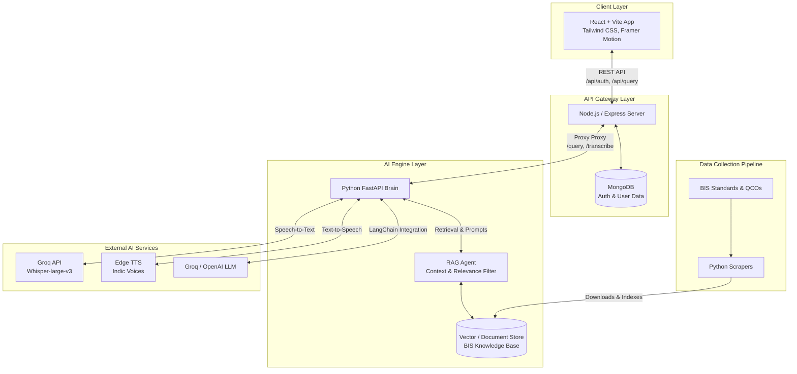
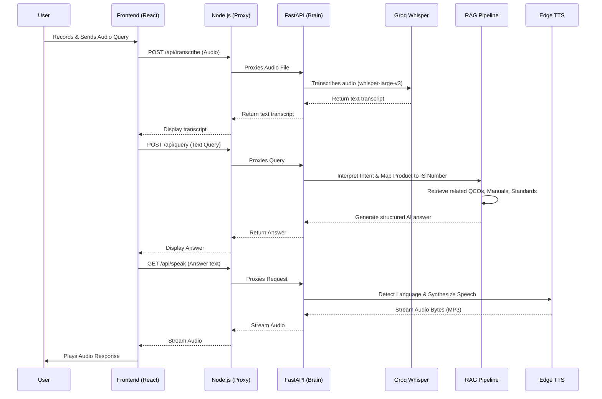

# 🇮🇳 Jagruk Swadesh

**Jagruk Swadesh** is an AI-powered conversational platform designed to enhance citizen awareness and streamline the understanding of the **Bureau of Indian Standards (BIS)** regulatory and certification framework. It features voice and text interactions, advanced Retrieval-Augmented Generation (RAG) for accurate information delivery, and a scalable microservices architecture combining a modern React frontend with Node.js and Python AI services.

---

## 🌟 Key Features

- **Voice & Text Interaction:** Engage with the system using natural language queries via text or spoken audio.
- **Indic Language Support:** Automatic detection and text-to-speech synthesis tailored to regional Indian languages via Edge TTS.
- **Intelligent RAG Knowledge Base:** Dynamically retrieves exact standards (IS Numbers), Quality Control Orders (QCOs), and product manuals from an indexed dataset of BIS records.
- **Context-Aware Processing:** Maps informal product names (e.g., "immersion rod") to official BIS nomenclatures and filters out irrelevant standards from large archives to prevent hallucinations.
- **Data Ingestion Pipeline:** Automated web scraping and processing scripts that download and organize real-world BIS documents and APIs.

---

## 🏗️ System Architecture

The application is built on a decoupled, microservices-inspired architecture:

1. **Frontend Client (`sihFrontend`):** A responsive Single Page Application (SPA) built with React and Vite.
2. **API Gateway (`sihFrontend/server`):** A Node.js/Express server that manages authentication, handles MongoDB interactions, and acts as a proxy for the AI microservice.
3. **AI Brain (`fastapi_server.py` & `jagruk_brain_pipeline`):** A Python FastAPI service that orchestrates Speech-to-Text (Groq Whisper), Text-to-Speech (Edge TTS), and the Langchain/RAG workflow.



---

## 🔄 AI & Program Flow

This sequence illustrates a typical voice-based user interaction with the AI pipeline, showcasing the seamless handover between services.



---

## 🧠 The RAG Agent Engine (`RAG/Rag_agent.py`)

The core of the intelligence lies in the RAG agent, specifically programmed to act as the **BIS Regulatory & Certification Assistant**. 
It executes a precise methodology to ensure accuracy:
- **Product Identification:** Translates user colloquials into standard nomenclature.
- **Standard Anchoring:** Links the identified product strictly to its corresponding IS Number (e.g., IS 368:2014).
- **Archive Pruning:** Selectively ignores noisy data from large retrieved JSON manifests or PDFs, focusing only on the anchored standard to prevent hallucinated regulations.

---

## 💻 Tech Stack

### Frontend
- **Framework:** React 18, Vite
- **Styling & UI:** Tailwind CSS, Framer Motion, Lucide React
- **Markdown Parsing:** React Markdown, Remark GFM

### Backend (API Gateway)
- **Runtime:** Node.js, Express
- **Database:** MongoDB (Mongoose)

### Backend (AI Core)
- **Framework:** Python 3.10+, FastAPI
- **LLM / Orchestration:** LangChain, `jagruk_brain_pipeline`
- **Speech-to-Text:** Groq API (`whisper-large-v3`)
- **Text-to-Speech:** `edge_tts` (Dynamic Indic Voice Selection)

---

## 📁 Project Directory Structure

```text
sih/
├── sihFrontend/               # Frontend Client & Express Gateway
│   ├── src/                   # React UI components, Pages, Hooks
│   ├── server/                # Node.js Express server (Auth, DB, Proxy)
│   ├── package.json           # Unified scripts for the entire stack
│   └── vite.config.js         # Vite configuration
├── fastapi_server.py          # Main Python AI service entry point
├── jagruk_brain_pipeline/     # Core AI StateGraph and execution pipeline
├── RAG/                       # RAG prompt engineering and contextual filtering
│   └── Rag_agent.py           # Core logic for parsing BIS knowledge base
├── data_collection_pipeline/  # Scripts for scraping and ingesting BIS data
│   ├── download_documents.py  # Automated PDF and JSON ingestion
│   └── scraper/               # Targeted web scrapers
├── bis_real_data/             # Local datastore of raw BIS and QCO records
└── requirements.txt           # Python dependencies for the AI Brain
```

---

## 🚀 Setup & Installation

### Prerequisites
- **Node.js** (v18 or higher)
- **Python** (v3.10 or higher)
- **MongoDB** (Local instance or Atlas URI)
- **Groq API Key** (For Whisper STT and LLM)

### 1. Clone & Install Dependencies

```bash
# Install Python dependencies for the AI Brain
pip install -r requirements.txt

# Install Frontend dependencies
cd sihFrontend
npm install

# Install Node.js API Gateway dependencies
cd server
npm install
```

### 2. Environment Variables configuration

You will need two separate environment files.

**Root Directory (`sih/.env`):**
```env
# Used by Python FastAPI
API_KEY=your_groq_api_key_here
```

**Node Server Directory (`sih/sihFrontend/server/.env`):**
```env
# Used by Express Server
PORT=5000
CLIENT_URL=http://localhost:5173
FASTAPI_HOST=localhost
FASTAPI_PORT=8000
MONGODB_URI=your_mongodb_connection_string
```

### 3. Running the Stack

The project uses `concurrently` to launch the React frontend, the Node.js Express server, and the Python FastAPI server all at once.

From the `sih/sihFrontend` directory, run:
```bash
npm run dev
```

**Services Started:**
- ⚛️ **Vite Frontend:** `http://localhost:5173`
- 🔐 **Express API Gateway:** `http://localhost:5000`
- 🧠 **FastAPI AI Brain:** `http://localhost:8000`
